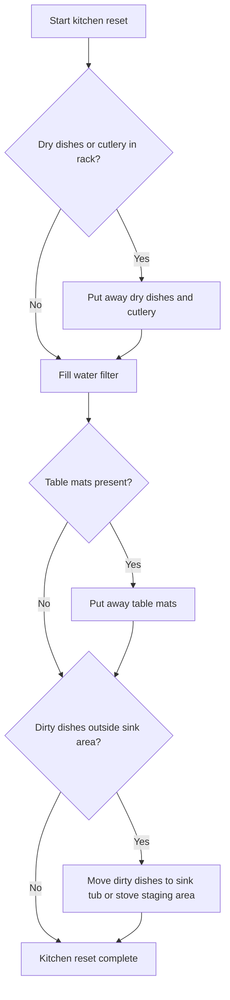

# Handoff

## Project
- Repo name: `kitchen-reset-page`
- Local path: `/Users/johncosnett/PycharmProjects/kitchen-reset-page`
- GitHub: `https://github.com/ccosnett/kitchen-reset-page`
- Visibility: private
- Default branch: `main`

## Linear Context
- Workspace/team: `Sid Meier's Blockchain's`
- Project: `Reset Room`
- Issue: `SID-200`
- Issue title: `make kitchen reset page`
- Issue URL: `https://linear.app/sid-meiers-blockchains/issue/SID-200/make-kitchen-reset-page`
- The issue was created during this session and is currently in `Backlog`.

## What Was Done In This Session
- Created the local git repo.
- Created the private GitHub repo and pushed the initial commit.
- Added a kitchen reset flowchart in Mermaid.
- Updated the top-level README to link to the flowchart file.

## Current Files
- `README.md`
  - Short project description.
  - Links to the flowchart document.
- `docs/kitchen-reset-flowchart.md`
  - Contains the Mermaid diagram.
  - Contains the Mermaid source block used to generate it.

## Current Working Idea
The kitchen reset flow was optimized for shortest elapsed time by starting the passive task early.

Flow order:
1. Put away dry dishes and cutlery from the sink rack.
2. Fill the water filter.
3. Put away table mats if present.
4. Move dirty dishes to the sink tub or onto the stove staging area.

## Current Mermaid Source


## Git Status At Handoff
There are uncommitted changes in the repo at the time of handoff:
- Modified: `README.md`
- Untracked: `docs/kitchen-reset-flowchart.md`

A new Codex session should run `git status` first and decide whether to commit these files.

## Recommended Next Steps
1. Open this repo as the active workspace in a new Codex session.
2. Inspect `README.md` and `docs/kitchen-reset-flowchart.md`.
3. Commit the current documentation changes.
4. Decide whether to turn the flowchart into an actual web page.
5. If building the page, keep it simple first: a single page with the rendered chart and a short checklist.

## Suggested Prompt For The Next Codex Session
```text
Use /Users/johncosnett/PycharmProjects/kitchen-reset-page as the active repo.
Read HANDOFF.md first.
Then inspect the uncommitted changes, commit the documentation work if it looks good, and help me build the kitchen reset page for Linear issue SID-200.
```
