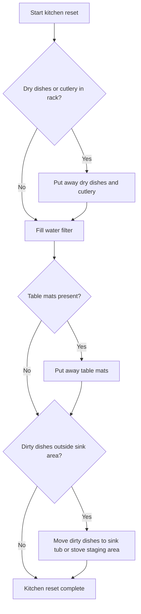

# Kitchen Reset Flowchart

This file contains the rendered Mermaid flowchart and the source code used to generate it.

## Diagram

```mermaid
flowchart TD
    A["Start kitchen reset"] --> B{"Dry dishes or cutlery in rack?"}
    B -- Yes --> C["Put away dry dishes and cutlery"]
    B -- No --> D["Fill water filter"]
    C --> D
    D --> E{"Table mats present?"}
    E -- Yes --> F["Put away table mats"]
    E -- No --> G{"Dirty dishes outside sink area?"}
    F --> G
    G -- Yes --> H["Move dirty dishes to sink tub or stove staging area"]
    G -- No --> I["Kitchen reset complete"]
    H --> I
```

## Source

```mermaid
flowchart TD
    A["Start kitchen reset"] --> B{"Dry dishes or cutlery in rack?"}
    B -- Yes --> C["Put away dry dishes and cutlery"]
    B -- No --> D["Fill water filter"]
    C --> D
    D --> E{"Table mats present?"}
    E -- Yes --> F["Put away table mats"]
    E -- No --> G{"Dirty dishes outside sink area?"}
    F --> G
    G -- Yes --> H["Move dirty dishes to sink tub or stove staging area"]
    G -- No --> I["Kitchen reset complete"]
    H --> I
```
